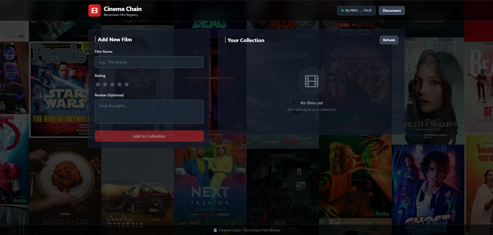
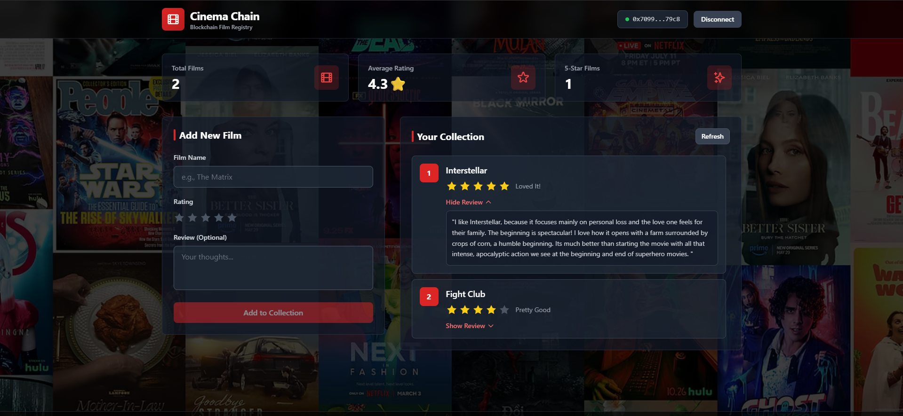

# Cinema Chain - Decentralized Film Tracker DApp

A beautiful, full-stack decentralized application for tracking and rating films you've watched on the blockchain. Built with React, Solidity, Ethers.js, and Tailwind CSS with a professional film page aesthetic.

## ✨ Features

- **Smart Contract**: Solidity-based film registry with ratings (1-5 stars) and reviews
- **Professional UI**: Clean, minimalistic design with film poster background and red/gray theme
- **Interactive Star Rating**: Casual rating labels (Not Good → Loved It!) with hover tooltips
- **Film Reviews**: Add optional written reviews with smart hover + click interaction
- **Statistics Dashboard**: View total films, average rating, and 5-star count
- **Wallet Management**: Connect/disconnect Metamask with network auto-switching
- **Auto-dismiss Messages**: Success notifications disappear after 3 seconds
- **Hover + Click Reviews**: Reviews show on hover and can be pinned by clicking
- **Local Development**: Configured for Hardhat local blockchain
- **Real-time Updates**: Automatic refresh of film collection after additions
- **Transaction Feedback**: Clear loading states and success/error messages

## 📋 Prerequisites

Before you begin, ensure you have installed:

- **Node.js** (v16 or higher)
- **npm** or **yarn**
- **Metamask** browser extension

## 🚀 Quick Start

### 1. Install Dependencies

```bash
npm install
```

### 2. Start Local Hardhat Node

Open a new terminal and run:

```bash
npm run node
```

This will start a local blockchain on `http://localhost:8545` and display test accounts with private keys.

### 3. Deploy the Smart Contract

In another terminal, deploy the contract:

```bash
npm run deploy
```

**Important**: Copy the deployed contract address and update it in `App.jsx`:

```javascript
const CONTRACT_ADDRESS = "YOUR_DEPLOYED_CONTRACT_ADDRESS";
```

### 4. Configure Metamask

1. Open Metamask
2. Add a new network:
   - **Network Name**: Hardhat Local
   - **RPC URL**: http://localhost:8545
   - **Chain ID**: 31337
   - **Currency Symbol**: ETH
3. Import one of the test accounts using a private key from the Hardhat node output

### 5. Start the React App

```bash
npm run dev
```

The application will open at `http://localhost:5173`

## 🎯 How to Use

1. **Connect Wallet**: Click "Connect Wallet" button in the header
   - Automatically switches to Hardhat Local network (Chain ID: 31337)
   - Shows connected wallet address in header
2. **Add a Film**: 
   - Enter the film name (e.g., "The Matrix")
   - Hover over stars to see rating labels:
     - 1 star: "Not Good"
     - 2 stars: "Could Be Better"
     - 3 stars: "It's Okay"
     - 4 stars: "Pretty Good"
     - 5 stars: "Loved It!"
   - Click on stars to select your rating
   - Optionally add a written review
   - Click "Add to Collection"
   - Confirm the transaction in Metamask
3. **View Your Collection**: All films appear with ratings and labels
4. **Read Reviews**: 
   - Hover over a film card to auto-show the review
   - Click "Show Review" to pin it open (stays visible even when not hovering)
   - Click again to hide
5. **View Stats**: See total films, average rating, and 5-star count at the top
6. **Disconnect**: Click "Disconnect" button to clear wallet connection

## 📁 Project Structure

```
cinema-chain/
├── App.jsx                 # Main React component with full DApp logic
├── contracts/
│   └── FilmRegistry.sol    # Solidity smart contract for films
├── scripts/
│   └── deploy.cjs          # Deployment script
├── test/
│   └── FilmRegistry.test.cjs  # Smart contract tests
├── src/
│   ├── main.jsx           # React entry point
│   ├── index.css          # Tailwind CSS + custom scrollbar styles
│   └── imagepng.png       # Film poster collage background
├── hardhat.config.cjs     # Hardhat configuration
├── hardhat.config.js      # Hardhat configuration (alternate)
├── vite.config.js         # Vite configuration
├── tailwind.config.js     # Tailwind CSS configuration
├── postcss.config.js      # PostCSS configuration
├── package.json           # Dependencies and scripts
└── README.md              # This file
```

## 🔧 Smart Contract

The `FilmRegistry.sol` contract includes:

```solidity
struct Film {
    string filmName;
    uint8 rating;      // 1-5 stars
    string review;
}

function addFilm(string memory _filmName, uint8 _rating, string memory _review)
function getAllFilms() public view returns (Film[] memory)
function getFilmCount() public view returns (uint256)
```

### Rating Validation
- Ratings must be between 1 and 5
- Contract will revert if invalid rating is provided

## 🎨 UI Features

- **Film Poster Background**: Cinematic collage background with dark overlay
- **Red/Gray Professional Theme**: Clean, modern color scheme without glow effects
- **Interactive Star Rating**: 
  - Hover tooltips showing rating labels
  - Visual feedback with yellow stars
  - Casual, friendly rating text
- **Smart Review Display**:
  - Auto-show on hover for quick previews
  - Click to pin review open
  - Toggle between show/hide states
- **Statistics Cards**: 
  - Total Films Watched
  - Average Rating (with star emoji)
  - Number of 5-Star Films
- **Auto-dismiss Messages**: Success notifications disappear after 3 seconds
- **Wallet Status**: 
  - Green indicator when connected
  - Formatted address display
  - Disconnect button in header
- **Fixed Footer**: Always visible at bottom of viewport
- **Custom Scrollbar**: Red-themed scrollbar for film collection
- **Responsive Design**: Works on mobile, tablet, and desktop
- **Loading States**: Visual feedback during blockchain operations
- **Error Handling**: Clear error messages for failed transactions

## 📸 Screenshots

### Main Interface - Film Collection

*The main dashboard showing film collection with ratings, reviews, and statistics*

### Add Film Form

*Interactive form with star rating system and review input*

## 🛠️ Technologies Used

- **Frontend**: React 18, Vite 5
- **Styling**: Tailwind CSS 3.4
- **Blockchain**: Solidity ^0.8.0, Hardhat 2.27
- **Web3**: Ethers.js v6.10
- **Wallet**: Metamask
- **Testing**: Chai, Hardhat Test Framework
- **Build Tools**: PostCSS, Autoprefixer

## 🧪 Running Tests

Run the smart contract tests:

```bash
npm test
```

This will execute comprehensive tests including:
- Film addition with valid ratings
- Rating validation (rejects <1 and >6)
- Film retrieval
- Event emission
- Gas optimization checks

## 📝 Available Scripts

- `npm run dev` - Start Vite development server (frontend)
- `npm run build` - Build production frontend
- `npm run node` - Start Hardhat local blockchain node
- `npm run compile` - Compile smart contracts
- `npm run deploy` - Deploy FilmRegistry contract to local network
- `npm test` - Run smart contract tests

## 📝 Common Issues

### Transaction Fails
- Ensure you're connected to the Hardhat network (Chain ID: 31337)
- Check that the contract address is correct in App.jsx
- Verify you have sufficient test ETH
- Make sure rating is between 1 and 5

### Can't Connect Wallet
- Install Metamask extension
- Add Hardhat network to Metamask
- Import a test account from Hardhat node

### Contract Not Found
- Make sure Hardhat node is running (`npm run node`)
- Verify contract is deployed (`npm run deploy`)
- Check the contract address matches in App.jsx

### Rating Rejected
- Ensure rating is between 1 and 5 stars
- The smart contract enforces this validation

### Background Image Not Showing
- Place your film poster collage image in `src/imagepng.png`
- Or update the image path in `App.jsx` line 311
- Fallback shows dark background if image fails to load

## 🎬 Example Films to Add

Try adding these classics to your collection:
- The Shawshank Redemption (5 stars - "Loved It!")
- The Godfather (5 stars - "Loved It!")
- The Dark Knight (5 stars - "Loved It!")
- Pulp Fiction (4 stars - "Pretty Good")
- Forrest Gump (4 stars - "Pretty Good")
- Inception (5 stars - "Loved It!")
- The Matrix (5 stars - "Loved It!")
- Interstellar (5 stars - "Loved It!")
- Parasite (5 stars - "Loved It!")
- Joker (4 stars - "Pretty Good")

## 🎯 Key Features Breakdown

### Rating System
- **1 Star**: "Not Good"
- **2 Stars**: "Could Be Better"
- **3 Stars**: "It's Okay"
- **4 Stars**: "Pretty Good"
- **5 Stars**: "Loved It!"

### Review Interactions
1. **Hover**: Move mouse over film card → review appears automatically
2. **Click**: Click "Show Review" button → review stays visible (pinned)
3. **Toggle**: Click again → review hides even on hover

### Auto-dismiss Behavior
- Success messages ("Connected!", "Film added!") disappear after 3 seconds
- Error and info messages stay until dismissed or replaced

## 📄 License

MIT License - Feel free to use this project for learning and development.

## 🙌 Contributing

Contributions, issues, and feature requests are welcome!

---

Built with ❤️ using React, Solidity, and Web3 | Track your cinematic journey on the blockchain! 🎬

---


